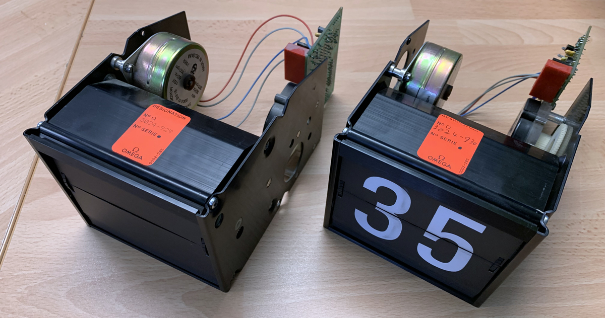
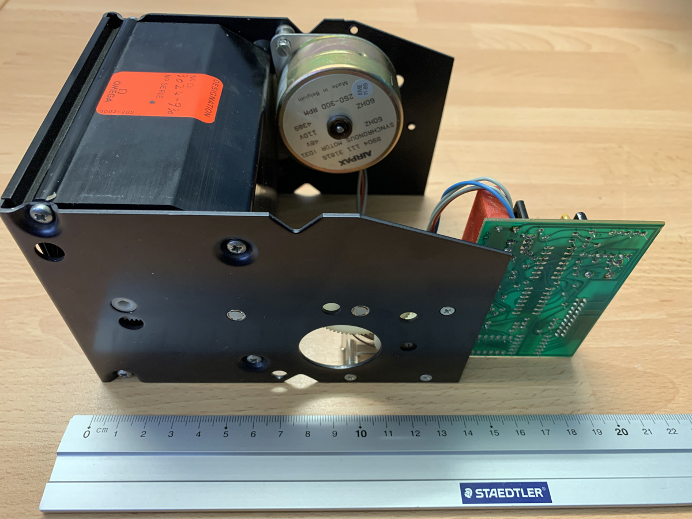
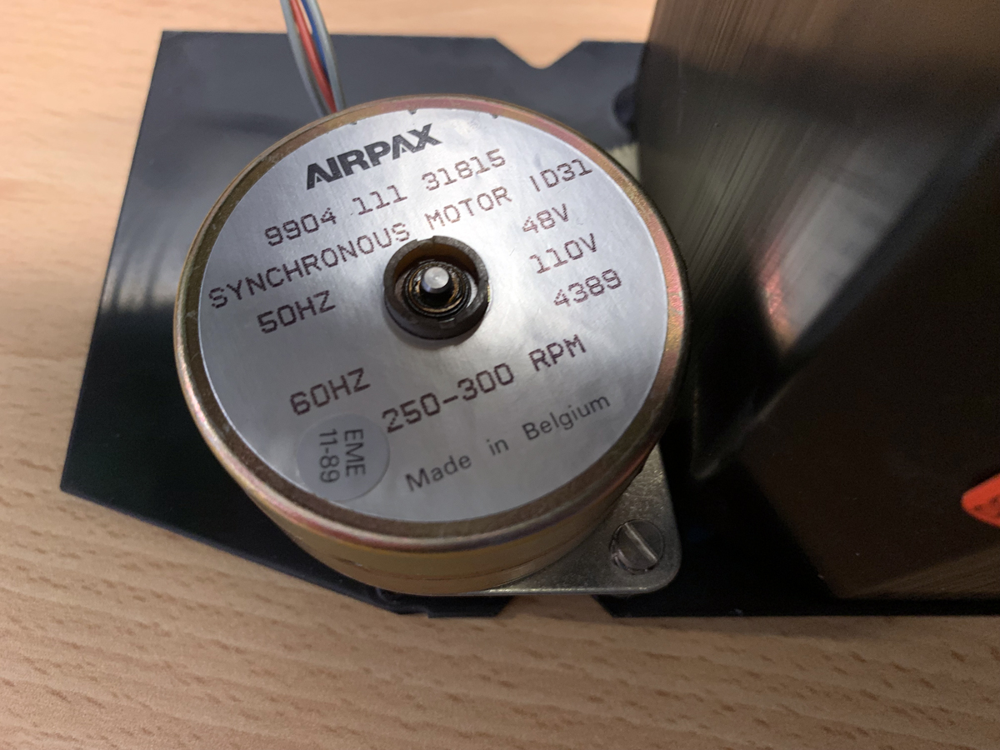
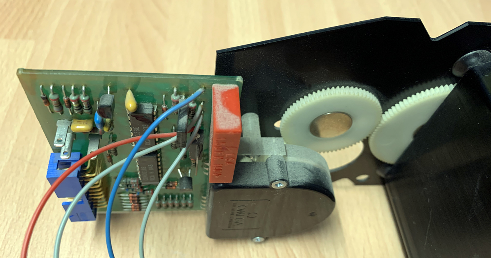
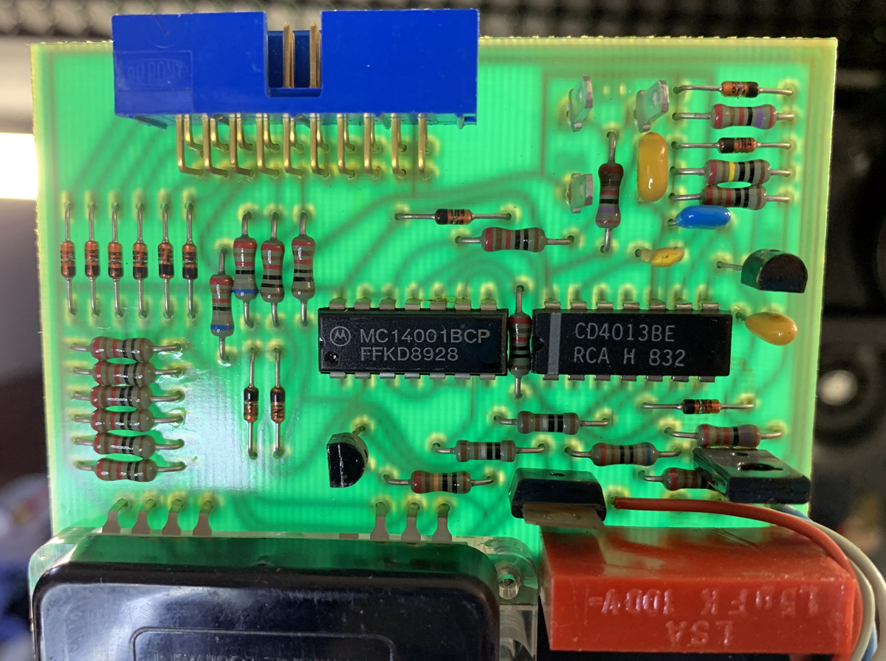
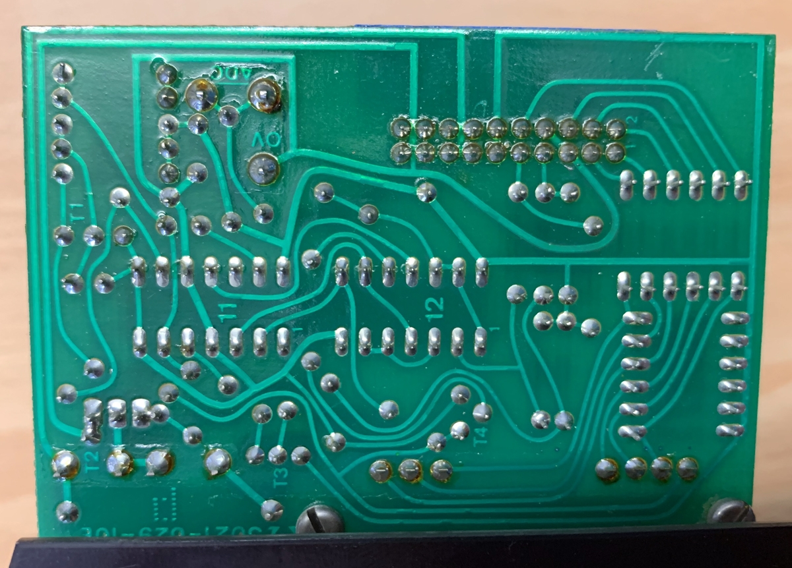

# Split-flap Clock

## Connector Pinot

| Pin | Signal  |
|-----|-------- |
|1    | DATA 2  |
|2    | DATA 0  |
|3    | DATA 4  |
|4    | DATA 5  |
|5    | 0V  DC  |
|6    | DATA 3  |
|7    | START   |
|8    | 0V DC   |
|9    | ADL     |
|10   | DATA 1  |
|11   | 12V DC  |
|12   | 12V DC  |
|13   | 48V AC  |
|14   | 48V AC  |
|15   | 48V AC  |
|16   | 48V AC  |
|17   | 0 AC    |
|18   | 0 AC    |
|19   | 0 AC    |
|20   | 0 AC    |

0V DC (pins 5 and 8) is connected to 0V AC (pins 17-20)

## Faston Pins
| Pin | Signal       |
|-----| ------------ |
|P1   | ADC          |
|P2   | ADC          |
|P3   | 0V DC and AC |

## More photos

